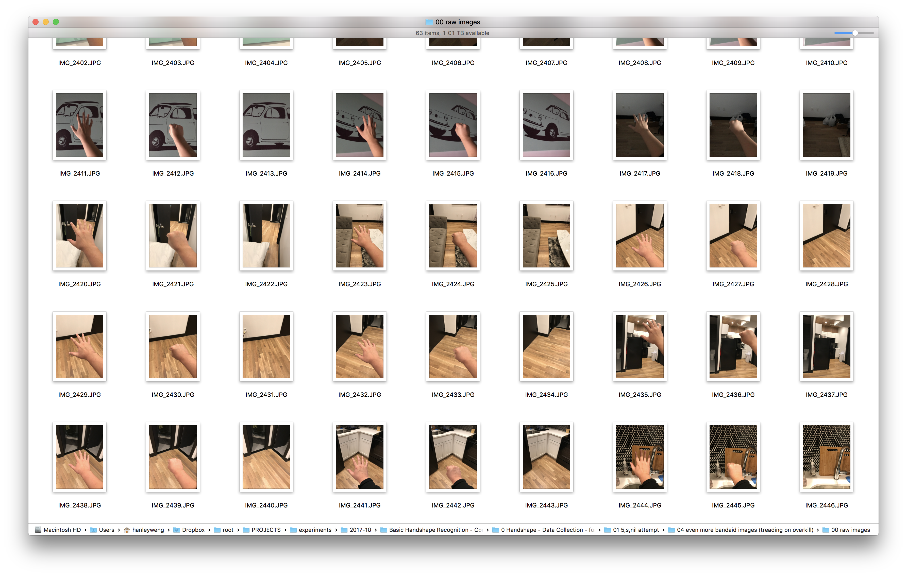

# Hand Gesture Recognition
This simple sample project recognizes hands in realtime. 👋 It serves as a basic example for recognizing your own objects. Suitable for AR 🤓. Written for the tutorial [“Create your own Object Recognizer”](https://medium.com/p/7f8c09b461a1).

[Demo Video - on Youtube](https://youtu.be/P3Q8awgT9Lk)

Tech: iOS 11, ARKit, CoreML, iPhone 7 plus, Xcode 9.1, Swift 4.0

## Notes: 

This demonstrates basic Object Recognition (for spread hand 🖐, fist 👊, and no hands ❎). It serves as a building block for object detection, localization, gesture-recognition, and hand tracking.

Disclaimer:

The sample model provided here was captured in 1 hour and is biased to one human hand 👋🏼. It’s intended as a placeholder for your own models. (See [Tutorial](https://medium.com/p/7f8c09b461a1))

---
## Steps Taken (Overview)

_Here’s an overview of the steps taken. (You can also view my commit history to see steps involved.)_

1. Build an Intuition by playing with Google CL's [Teachable Machine](https://teachablemachine.withgoogle.com/).
2. Build dataset.
3. Create a Core ML Model using Microsoft's [CustomVision.ai](https://www.customvision.ai/).
4. Run the model in realtime with ARKit.

[Full Tutorial here](https://medium.com/p/7f8c09b461a1)

_P.S. A few well selected images are sufficient for CustomVision.ai . For the sample model here, I did 3 rounds of data collection (adding 63, 38, 21 images per round). Alternating classes during data collection also appeared to work better than gathering all the class images at once._

## License
MIT Open Source License. 🧞 Use as you wish. Have fun! 😁
